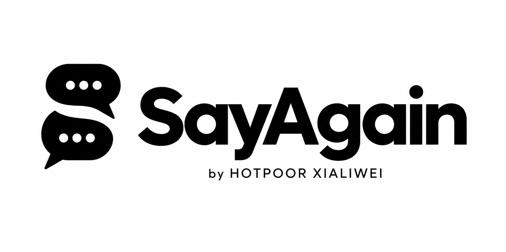
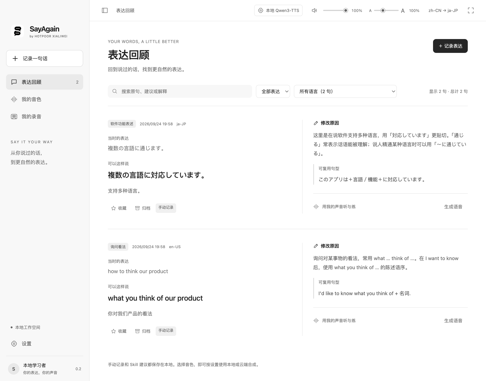
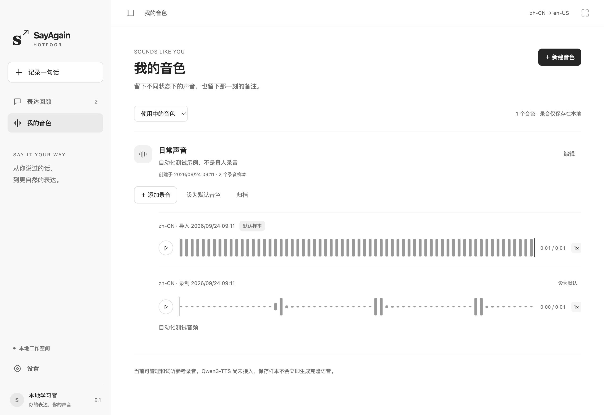

# HOTPOOR SayAgain



**用自己的声音，把每句话说得更自然。**

HOTPOOR SayAgain 希望把真实对话变成持续的语言练习：发现值得改进的表达，用母语解释原因，再用自己的音色听一遍、跟读一遍。面向多种母语与目标语言组合，而不局限于英语。

> Electron 源码客户端 v0.2：设置顶部提供多个 Qwen AK 的命名、查看、切换、本地明文保存和平台快捷链接；已接入音色克隆与合成任务流程、13 款克隆模型分组选择与用户默认模型、Skill 本地评估接口。Qwen3-TTS VC 与 Qwen-Audio 3.0 TTS Plus 已完成真实合成，本地模型推理尚未验证；尚无安装包。

## 为什么做 SayAgain

与 AI 一起工作、讨论问题时，我们已经在不断使用语言。但这些对话中的表达问题常常随着聊天记录被遗忘：当时知道了怎么改，之后却很难找到、复习和真正用起来。

我们希望把这段过程连起来：保留自己当时想说的话，理解更自然的表达方式，再听到“自己的声音”说出它。练习内容来自真实需求，也能逐渐积累成属于自己的表达库和音色库。

## 来自真实对话的例子

下面的片段来自开发者使用 SayAgain 讨论产品、练习英语和日语时的真实对话，经本人同意公开。保留原始表达，再结合当时的意思给出建议。

| 当时的表达 | 可以这样说 | 为什么这样改 |
| --- | --- | --- |
| how to think our product | what you think of our product | 想询问对产品的看法，可用 `what … think of …`；放在 `I want to know` 后时使用陈述语序。 |
| give some suggestion | give some suggestions | `suggestion` 是可数名词，这里的 `some` 搭配复数 `suggestions`。 |
| 複数の言語に通じます。 | 複数の言語に対応しています。 | 在讨论软件支持多种语言的语境中，「対応しています」更贴切。 |

同一段日语中的「これは素晴らしいですね。」已经自然，不需要修改。SayAgain 保留有依据的建议；类别可由 Skill 按语境推理，也可手动填写自定义标签，例如「询问看法」或「软件功能表述」。

下面的表达回顾截图使用其中两个片段在独立演示工作空间重建，因此条目标为「手动记录」；文字来自真实对话，截图中的时间与记录数属于演示数据。它同时展示英语和日语记录，以及语言筛选和句数统计。

## 我们希望做到

- **融入日常对话**：在用户启用的会话中，每条最终用户消息都触发一次表达评估，后台处理，不打断正在进行的工作。
- **有理由才建议**：区分语法错误、措辞优化和风格选择；表达已经合适时不强行修改，原意不清时先确认。
- **支持多语言学习**：先选择母语和目标语言，用熟悉的语言理解原因、译文和可复用句型；保留不同语言对的学习记录。
- **用自己的声音练习**：支持多个音色和参考录音，保存名称、备注、创建日期，按需归档或恢复，保留历史音频。
- **数据留在自己手里**：优先本地保存、合成和管理，提供可导出、可备份的数据结构。
- **回顾界面保持简单**：清晰呈现原句、建议、解释和听练区域，用留白与分隔组织内容，避免多层卡片嵌套。

以上是产品目标，具体实现进度见下表。

## 本地优先

优先推荐本地方案：用户使用自己的 Codex、Claude Code 或其他兼容客户端，由 SayAgain 的 Skill 与客户端适配器协作完成表达评估，在本机安装 Qwen3-TTS 进行音色克隆和语音合成，使用 SQLite 保存记录。

```text
真实对话 → 表达评估 → 原句 / 建议 / 母语解释 / 句型
                                  ↓
                           本地个人表达库
                                  ↓
                  选择自己的音色 → 本地合成 → 听与练
```

本地方案不代表所有推理都离线：表达评估是否经过云端，取决于用户选择的客户端与模型。录音与合成默认在本地处理。模型支持的合成语言、硬件要求和速度需要分别验证，不能把多语言数据支持等同于任意语言语音合成。

可靠的逐轮评估需要客户端事件适配，单独提供 Skill 并不能保证每轮触发。我们会逐个验证客户端接入能力，并明确自动与手动接入的区别。

空间不足时明确提示无法安装本地 Qwen3-TTS，并提供千问AI平台云端入口。当前优先完成此设备的云端接入；用户填写 AK、启用云端后，确认发送选定参考录音和文本；也可在顶部语音设置中授权复用默认选择，之后手动点击生成时无需重复弹窗。无云端数据同步。详见[语音接入](docs/speech.md)。

## 桌面客户端与界面方向


横向 LOGO 用于项目品牌展示，署名为 **by HOTPOOR XIALIWEI**；圆角矩形应用图标保留双气泡 S，已接入窗口图标与 macOS Dock。

客户端采用 **Electron**。页面功能和内容展示以现有 Nexplay 线上版本为参考；桌面布局与视觉尽量参考 **Codex 和 ChatGPT 客户端**，保留 SayAgain 自己的品牌与语言练习流程。

- 可收起的侧栏组织表达回顾、音色库和设置；主体保留充足阅读空间。
- 使用克制的黑白灰、轻量按钮、浅灰标签和清晰的文字层级。
- 表达条目不加最外层卡片框，条目之间增加留白；双栏用细竖线分隔，窄窗口切换单栏。
- 修改原因与句型归属清晰，减少嵌套；音轨默认展开，提供朗读、慢速与全屏入口。

基础窗口、表达回顾、音色库、设置与本地存储已实现。参考录音支持默认展开波形、拖动进度与 0.75× 慢放；表达的克隆语音支持任务状态、取消、缓存和生成后的波形播放。具体边界见[客户端设计](docs/desktop.md)。

“我的录音”支持麦克风连续录音、多文件导入及按会话保存。一个会话 `block_id` 可包含多个约 30 秒的音频片段，每段可播放、编辑文字，或使用本机 FSMN VAD + SenseVoice INT8 转写。模型由 Skill 下载登记；CAMPPlus 支持会话内候选说话人分组（实验功能），Zipformer 支持手动填写中英文关键词并分析已保存录音。长录音分析没有 100 段上限：同一进程顺序处理全部片段并显示进度，保持会话内说话人分组连续；仅当连续 10 分钟没有片段完成时才超时。录音页首先展示可按会话名称或音频文件名搜索的会话列表；进入会话后才显示添加语音文件、录音和片段列表，分析工具与模型状态默认折叠。分组不代表身份确认，重叠发言和短语音可能不准确；关键词目前显示命中次数，不提供精确命中时间。详见[录音模型配置](skills/sayagain/references/recordings.md)。运行 `node scripts/smoke-recordings.cjs` 可验证基本录音流程；传入 `SAYAGAIN_TEST_RUNTIME` 和 `SAYAGAIN_TEST_AUDIO` 还可验证已登记模型的实际客户端转写。模型权重、个人音频和本机路径不提交到仓库。



<details>
<summary>查看音色库与参考录音</summary>



</details>

## 当前进度

截至 **2026-09-24**：

| 模块 | 状态 | 已有成果 / 下一步 |
| --- | --- | --- |
| 产品目标与使用流程 | 已完成首版设计 | 本地优先、多语言配置、每轮评估、听练流程 |
| 音色与录音管理 | 基础功能已实现 | 新建与编辑音色、多录音样本、导入/录制、备注、日期、默认样本、归档恢复 |
| 数据协议 | 已完成首版设计 | 32 位十六进制 UUID、三库路由、实体字段与索引规则 |
| SQLite 建表定义 | 已编写并做基础验证 | 主库索引、分库单表、样例写入与约束、事务回滚和路由检查 |
| 本地存储服务 | 基础功能已实现 | 三库事务读写、索引更新/重建、修订检查与完整备份；备份可在隔离目录重新打开 |
| Skill 与表达评估 | 接入已实现 | 完整 Skill 复制/导出、本机授权桥接、结构化评估与回执；宿主每轮自动触发待验证 |
| 本地语音合成 | worker / 安装器已实现 | 空间预检、固定版本模型；当前机器空间不足，未下载或验证推理 |
| Electron 客户端界面 | 源码版可运行 | 语言引导、手动记录、搜索/收藏/归档、音色库、参考录音播放、全屏和窄窗口 |
| 客户端逐轮接入 | 待实现 | 分别验证事件触发、接入范围和处理回执 |
| 云端 API | Qwen 接入已实现 | AK 本地保存、平台跳转、音色复用与合成；Qwen3-TTS VC 与 Qwen-Audio Plus 已实测，其余已做模拟接口测试 |

已通过 38 项数据、评估和语音流程测试与 Electron 端到端检查，覆盖录音、播放、归档、AK 本地保存/移除、平台跳转及退出重开后的持久化。录音测试使用模拟麦克风，不代表真实麦克风听感、Qwen 模型运行或自动客户端接入已验证。当前只在 macOS 做过桌面验证。

## 从源码运行

需要 Node.js 22.13 或更新版本及 npm。当前使用 Electron 44.4.5 和 Node 内置 SQLite；基础客户端不需要 Python 或模型权重。

```sh
git clone https://github.com/hotpoor/HOTPOOR-SayAgain.git
cd HOTPOOR-SayAgain
npm ci
npm start
```

首次启动 Electron 时可能需要下载运行组件。首次进入先选择母语与目标语言，随后可手动记录表达或创建音色。录音会请求系统麦克风权限，也可以导入 WAV、MP3、M4A、OGG 或 WebM 文件。

数据保存在 Electron 用户数据目录下的 `data/`，具体位置可在「设置 → 本地数据」查看。可通过绝对路径环境变量 `SAYAGAIN_DATA_DIR` 指定独立用户目录；不要把真实数据放进代码仓库。

```sh
npm test                 # SQLite 与业务规则测试
npm run test:desktop     # Electron 检查，使用临时目录与模拟麦克风
npm run docs:check       # 开发日志、传记和图表同步检查
```

完整使用方式与当前限制见[本地开发说明](docs/development.md)。

## 第一阶段路线

1. **打好本地存储基础**：初始化三个 SQLite 库，实现统一实体读写、索引一致性和备份恢复。
2. **建立语言配置与音色库**：录制或导入参考音频，管理备注、日期、默认样本和归档。
3. **跑通表达评估**：先支持手动导入对话，通过 Skill 生成可追溯的建议，验证无需修改、原意不明和重复事件等情况。
4. **接上本地声音**：集成 Qwen3-TTS，完成生成、缓存、波形、朗读和慢速回放。
5. **接入日常工作流**：逐个适配客户端，实现可验证的逐轮触发。

第一阶段的验收目标是：选择语言对、导入一段真实表达、查看优化及原因、录制自己的音色、在本地合成并回放，重启后仍能完整找到记录。

## 数据结构

| SQLite 文件 | 用途 |
| --- | --- |
| `SayAgain` | 可重建的实体索引、去重索引和关系索引 |
| `SayAgain1` | 一张 `entities` 表，存放一部分实体 |
| `SayAgain2` | 一张 `entities` 表，存放另一部分实体 |

两份实体库均使用 `entities(block_id, body, createtime, updatetime)`。`body` 为 JSON 对象，时间为 Unix 毫秒时间戳。`block_id` 使用 UUID v4 去连字符后的 32 位小写十六进制编码，按 `int(block_id, 16) % 2 + 1` 分配到实体库。

音频、波形与模型文件独立保存，数据库记录其引用和元数据。完整规则见[数据协议](docs/data-model.md)。

## 开发记录

[开发日志 · 最新在前](DEVELOPMENT_LOG.md) · [开发传记 · 从起点读起](DEVELOPMENT_HISTORY.md)


每日分布按日志条数统计；两份文档共用记录和图表，包含可展开的本月明细。

## 仓库导览

- [Electron 客户端与界面方向](docs/desktop.md)
- [产品、配置与页面设计](docs/product.md)
- [数据模型、分库与一致性设计](docs/data-model.md)
- [主库索引 SQL](storage/index.sql)
- [实体分库 SQL](storage/entities.sql)
- [虚构实体示例](examples/entities.json)

除本页经本人明确同意公开的少量对话片段及其演示截图外，完整聊天记录、真实录音、个人数据库、模型权重和凭据不进入代码仓库。`examples/` 中的结构示例仍为虚构数据，不包含真实录音。

## 一起完善

欢迎通过 [Issues](https://github.com/hotpoor/HOTPOOR-SayAgain/issues) 分享希望支持的语言对、客户端接入需求、本地硬件体验，以及表达回顾和跟读方面的建议。反馈时请使用虚构或脱敏的示例。
