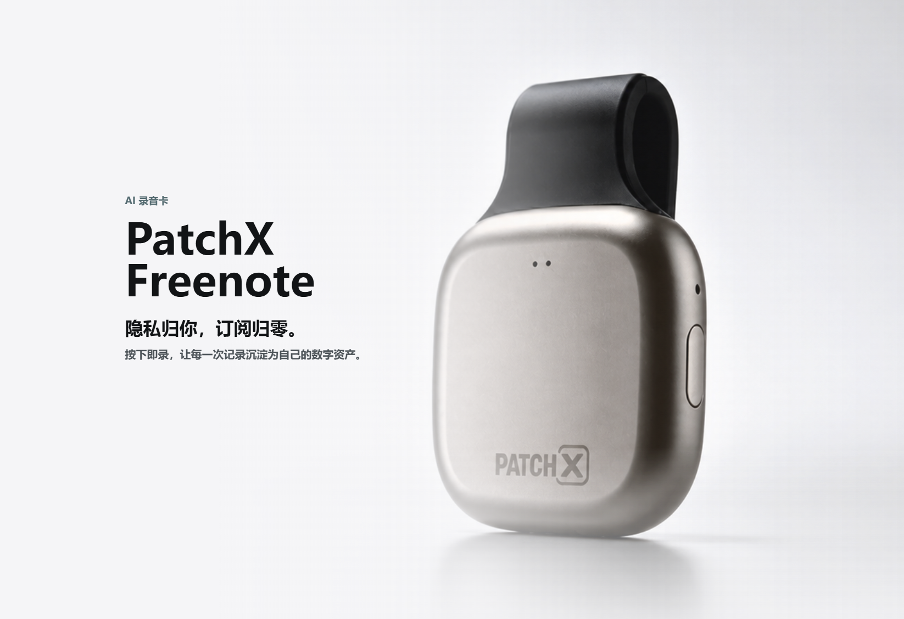

# HOTPOOR SayAgain


**用自己的声音，把每句话说得更自然。**

HOTPOOR SayAgain 希望把真实对话变成持续的语言练习：发现值得改进的表达，用母语解释原因，再用自己的音色听一遍、跟读一遍。面向多种母语与目标语言组合，而不局限于英语。

> Electron 源码客户端 v0.2.1：表达回顾、音色库与语音文件会话已接通。长音频可在本机分人拆条，自动转写后人工校对；紧凑 / 对话双视图支持原时间轴、说话人备注与头像、SVG 波形和连续发言吸附。本地转写已验证；本地 Qwen3-TTS 合成尚未验证。云端 Qwen 合成已接入，尚无安装包。

## v0.2.1 发布与模型下载

[GitHub Release v0.2.1](https://github.com/hotpoor/HOTPOOR-SayAgain/releases/tag/v0.2.1) 提供完整可移植 Skill 和8组本地模型附件，覆盖两份 SenseVoice、FSMN/Silero VAD、CAMPPlus、Zipformer KWS 与 Qwen3-TTS Base 0.6B/1.7B。大模型按1 GiB分卷，下载脚本自动合并并验证分卷、整包和解压文件 SHA256。只下载所选模型，不自动修改应用 runtime 或切换模型。

这是源码、Skill 与模型资源发布，尚无桌面安装包。使用方式见 [Release 模型下载](skills/sayagain/references/release-models.md)，完整指纹和固定下载地址见 [模型清单](skills/sayagain/assets/model-manifest.json)。模型各自的来源、许可及适配说明随附件保留。

## 为什么做 SayAgain

与 AI 一起工作、讨论问题时，我们已经在不断使用语言。但这些对话中的表达问题常常随着聊天记录被遗忘：当时知道了怎么改，之后却很难找到、复习和真正用起来。

我们希望把这段过程连起来：保留自己当时想说的话，理解更自然的表达方式，再听到“自己的声音”说出它。练习内容来自真实需求，也能逐渐积累成属于自己的表达库和音色库。

## 来自真实对话的例子

下面的片段来自开发者使用 SayAgain 讨论产品、练习英语和日语时的真实对话，经本人同意公开。保留原始表达，再结合当时的意思给出建议。

| 当时的表达 | 可以这样说 | 为什么这样改 |
| --- | --- | --- |
| how to think our product | what you think of our product | 想询问对产品的看法，可用 `what … think of …`；放在 `I want to know` 后时使用陈述语序。 |
| give some suggestion | give some suggestions | `suggestion` 是可数名词，这里的 `some` 搭配复数 `suggestions`。 |
| 複数の言語に通じます。 | 複数の言語に対応しています。 | 在讨论软件支持多种语言的语境中，「対応しています」更贴切。 |

同一段日语中的「これは素晴らしいですね。」已经自然，不需要修改。SayAgain 保留有依据的建议；类别可由 Skill 按语境推理，也可手动填写自定义标签，例如「询问看法」或「软件功能表述」。

下面的表达回顾截图使用其中两个片段在独立演示工作空间重建，因此条目标为「手动记录」；文字来自真实对话，截图中的时间与记录数属于演示数据。它同时展示英语和日语记录，以及语言筛选和句数统计。

## 我们希望做到

- **融入日常对话**：在用户启用的会话中，每条最终用户消息都触发一次表达评估，后台处理，不打断正在进行的工作。
- **有理由才建议**：区分语法错误、措辞优化和风格选择；表达已经合适时不强行修改，原意不清时先确认。
- **支持多语言学习**：先选择母语和目标语言，用熟悉的语言理解原因、译文和可复用句型；保留不同语言对的学习记录。
- **用自己的声音练习**：支持多个音色和参考录音，保存名称、备注、创建日期，按需归档或恢复，保留历史音频。
- **数据留在自己手里**：优先本地保存、合成和管理，提供可导出、可备份的数据结构。
- **回顾界面保持简单**：清晰呈现原句、建议、解释和听练区域，用留白与分隔组织内容，避免多层卡片嵌套。

以上是产品目标，具体实现进度见下表。

## 语音转写原理与来源

SayAgain 的语音处理流程先检测语音区间，再结合说话人信息分段，使用语音识别模型转写，最后供用户试听和校对。我们关注的输出不仅是识别文字，还包括标点、英文大小写、数字表达的规范化，以及分段边界处的正确拼接；这些环节需要分别验证，不能把格式改善等同于识别准确率提高，也不能跨说话人或无关语境误拼内容。

语音识别的来源模型是 [SenseVoiceSmall](https://huggingface.co/FunAudioLLM/SenseVoiceSmall)，通过 [sherpa-onnx](https://github.com/k2-fsa/sherpa-onnx) 运行相应的 ONNX 制品。SenseVoice 提供逆文本规范化（ITN）选项，将部分口语表达转换为更适合阅读的书面形式；具体权重、转换版本和运行设置会影响实际输出。现阶段暂缓模型版本选型与效果优劣的结论，标点、大小写和数字拼接作为后续验证目标，不在此承诺已全面实现。

### 感谢 PatchX FreeNote

在开发者的实际使用中，[PatchX FreeNote](https://freenote.patch-x.cn/download/) 的转写呈现给我们留下了良好印象，尤其让我们关注到标点、英文大小写与数字表达对阅读体验的价值。感谢团队围绕 SenseVoiceSmall 所做的产品优化，也感谢上游模型作者的工作。本次核验的内置样本与官方通用模型文件一致，详见下方来源证据。这是使用体验与致谢，不作为不同模型的全面性能排名。

我们也是 FreeNote 共创群的参与者，希望把真实问题和经过验证的改进反馈给团队，共同做出更好的产品。相关入口：[官方下载](https://freenote.patch-x.cn/download/)、[MCP 接入](https://freenote.patch-x.cn/mcp/setup/)。

<a href="https://freenote.patch-x.cn/download/"></a>

**产品推荐 · PatchX FreeNote**：如果你也需要随身录音设备，可以[前往官方页面了解产品与购买方式](https://freenote.patch-x.cn/download/)，点击页面中的「购买录音卡」查看。图片由开发者提供，图中产品宣传信息以官方说明为准。

## 本地优先

优先推荐本地方案：用户使用自己的 Codex、Claude Code 或其他兼容客户端，由 SayAgain 的 Skill 与客户端适配器协作完成表达评估，在本机安装 Qwen3-TTS 进行音色克隆和语音合成，使用 SQLite 保存记录。

```text
真实对话 → 表达评估 → 原句 / 建议 / 母语解释 / 句型
                                  ↓
                           本地个人表达库
                                  ↓
                  选择自己的音色 → 本地合成 → 听与练
```

本地方案不代表所有推理都离线：表达评估是否经过云端，取决于用户选择的客户端与模型。录音与合成默认在本地处理。模型支持的合成语言、硬件要求和速度需要分别验证，不能把多语言数据支持等同于任意语言语音合成。

可靠的逐轮评估需要客户端事件适配，单独提供 Skill 并不能保证每轮触发。我们会逐个验证客户端接入能力，并明确自动与手动接入的区别。

空间不足时明确提示无法安装本地 Qwen3-TTS，并提供千问AI平台云端入口。当前优先完成此设备的云端接入；用户填写 AK、启用云端后，确认发送选定参考录音和文本；也可在顶部语音设置中授权复用默认选择，之后手动点击生成时无需重复弹窗。无云端数据同步。详见[语音接入](docs/speech.md)。

## 桌面客户端与界面方向


横向 LOGO 用于项目品牌展示，署名为 **by HOTPOOR XIALIWEI**；圆角矩形应用图标保留双气泡 S，已接入窗口图标与 macOS Dock。

客户端采用 **Electron**。页面功能和内容展示以现有 Nexplay 线上版本为参考；桌面布局与视觉尽量参考 **Codex 和 ChatGPT 客户端**，保留 SayAgain 自己的品牌与语言练习流程。

- 可收起的侧栏组织表达回顾、音色库和设置；主体保留充足阅读空间。
- 使用克制的黑白灰、轻量按钮、浅灰标签和清晰的文字层级。
- 表达条目不加最外层卡片框，条目之间增加留白；双栏用细竖线分隔，窄窗口切换单栏。
- 修改原因与句型归属清晰，减少嵌套；音轨默认展开，提供朗读、慢速与全屏入口。

基础窗口、表达回顾、音色库、设置与本地存储已实现。参考录音支持默认展开波形、拖动进度与 0.75× 慢放；表达的克隆语音支持任务状态、取消、缓存和生成后的波形播放。具体边界见[客户端设计](docs/desktop.md)。

## 语音文件模式：让一场对话可以回看、校对、继续使用

我们希望语音文件不只是播放器后面的一大段文字。它应当回答：**哪个文件、谁在什么时间说了什么、哪些是机器判断、哪些已经由人确认。** 当前入口是「我的音频」。

### 已实现的使用流程

1. **建立会话或导入长音频**：保留原文件，支持多个音频来源。列表可按会话名 / 文件名搜索，并显示创建时间、最后更新时间。
2. **生成候选语音条**：「分人语音条」使用本机 FFmpeg、Silero VAD、CAMPPlus 和聚类策略，把音频拆成最长约 18 秒的条目，保存到当前会话的音频分组中。支持语言、自动 / 指定人数、进度与取消。单次最长 4 小时；直接文件导入上限 2 GiB。
3. **试听、修正并确认**：每段保留原文件起止时间。可改边界、勾选已有的一位 / 多位说话人，或新增标签；“不确定”不与具体人同时选。原文已自动生成，确认用于校正候选，不再作为转写前置条件。
4. **转写与校对**：SenseVoice INT8 在分人拆条后自动生成原语言文字，保留说话人归属。人工修订优先显示；修改分段后，旧转写标记待更新。自动文字仍需校对。
5. **阅读与整理**：按文件折叠、按说话人筛选、按时间正序 / 倒序、内联滚动浏览（高度可调、侧边位置滑块与一键回顶），并导出带来源、起止时间和备注名的 `transcript.txt`。

### 导入前检查与 Windows 文件找不到排查

配置录音环境、迁移电脑或导入失败时，依次检查：

1. **实际数据目录**：确认当前客户端使用的目录（包括 `SAYAGAIN_DATA_DIR` 覆盖），读取其中的 `recording-models/runtime.json`；不要检查另一个安装实例的配置。
2. **Python 和模型**：确认 `runtime.python` 是存在且可运行的解释器，用它检查依赖；核对 SenseVoice 的模型与词表、CAMPPlus，以及 Silero 或 FSMN 的实际文件。环境存在或 `verified: true` 的历史记录不代表迁移后的路径仍有效。
3. **FFmpeg**：分人导入按 `SAYAGAIN_FFMPEG` → `runtime.ffmpeg` → 应用自带 `ffmpeg-static` 选择程序。显式配置无效会报错，不会跳过它。Windows 源码版通常为项目下 `node_modules/ffmpeg-static/ffmpeg.exe`；不要假定系统 PATH 已配置。独立导出的 Skill 不附带该二进制，应定位实际客户端安装中的程序或用户已有安装。
4. **实际解码**：用录音环境的 Python 通过参数数组调用 FFmpeg 的绝对路径，将隔离短样例解码到新的临时 WAV，确认输出非空、16 kHz、单声道。检查中文和空格路径；仅执行 `-version` 不算解码验证。
5. **导入验证**：再用获准的短语音样例检查客户端分段、转写、原文件保留与重开后的结果。程序存在、解码成功、模型推理成功和完整导入成功分别记录，不能互相代替。

`[WinError 2]` 要先定位哪个子进程启动失败，不要直接判断为所选音频丢失。已知情形是旧配置没有 `ffmpeg` 字段，而旧导入流程尝试运行 PATH 中不存在的 `ffmpeg`。核对 Python、FFmpeg 和源文件后，备份配置，只修正失效字段，保留模型路径及验证记录；若只有 FFmpeg 路径缺失，不重跑模型安装或注册脚本。当前流程每次开始导入会重新读取 runtime，修正它可直接重试；修改进程环境变量或主进程代码则需重启客户端。

详细命令与检查边界见 [Skill 导入前检查](skills/sayagain/references/recordings.md#import-preflight-and-winerror-2)。

### 阅读与播放

| 功能 | 当前行为 |
| --- | --- |
| 紧凑 / 对话 Tab | 紧凑版按头像、姓名、时间、正文与操作对齐；对话版采用气泡。切换不重建输入框，保留未保存草稿，支持方向键切换。 |
| 文件分组 | 文件头显示序号、时间、时长、说话人和整体播放；全部片段内联滚动，高度240–1200像素可调（可拖动底部状态栏）；侧边滑块可快速定位并回顶。没有完整原文件时提供片段顺序播放。 |
| SVG 波形与局部时间轴 | 使用已保存的音频峰值，支持 1–5 倍缩放、随缩放变细的时间刻度、点击定位与播放竖线。放大只揭示已有采样细节，不生成新的音频信息。 |
| 独立整段进度 | 波形支持横向滚动，滚动条外观隐藏、高度固定；下面的圆点条与波形留出间距，明确标注“整段进度”。 |
| 说话人资料 | 当前会话内可改备注名、说明和本地头像。PNG / JPEG / WebP 图片上传后可在方形裁剪框内拖动、缩放，正圆镂空遮罩与实时圆形缩略图展示头像效果，确认后以 400×400 像素保存，可恢复文字头像；修改同步到文件头、发言行、筛选与文字导出中的名称。 |
| 人物形象页面 | 左侧独立入口，支持搜索、新建人物、编辑姓名备注、上传或选择默认头像、维护头像集合和默认波形颜色。 |
| 波形颜色 | 人物设置默认颜色；本次 Speaker 可独立选择颜色或恢复人物默认色。修改默认色同步所有未覆盖的引用，SVG 波形使用最终颜色。 |
| 日期统计与排序 | 表达回顾、我的音频、人物形象按本地创建日期显示数量时间轴，可选日期并按最早 / 最新排序，搜索同步缩小统计范围；表达回顾还联动语言、收藏和归档筛选，搜索栏滚动吸顶，右下角按钮可回到顶部。 |
| 人物库与引用 | 在 Speaker 卡片里搜索人物库，或指定“这个说话人就是本会话的另一位”。也可将姓名、备注和头像新建为人物。跨会话引用同一个人物，姓名与备注同步；关联可解除。 |
| 人物多头像 | 人物保留默认头像与头像集合，图片按内容去重保存在本地文件，数据库只存引用。本次 Speaker 上传或选择头像只影响本次引用，新头像收入人物库；可恢复人物默认头像，不覆盖其他会话的选择。 |
| 复制识别文字 | 每条语音可通过叠纸图标复制文字，成功后显示对勾和“已复制”提示。 |
| 跟随播放 | “整体播放 / 顺序播放”旁的定位播放图标可切换自动跟随，开启后按播放进度逐帧滚动，让当前片段进度保持在列表中部。默认关闭；手动滚轮、触摸滚动、拖动纵向滑块或回顶时退出跟随。 |
| 播放位置标记 | 右侧纵向轨道以红色横线标记当前播放语音条在完整列表中的位置，灰色滑块表示浏览位置；整段和单条播放均通过 requestAnimationFrame 同步；可滚动列表按当前片段对应的目标滚动位置映射轨道，上下预留圆点半径，跟随时红线对齐圆点中心；无滚动时直接对齐片段，调整高度后自动校准。 |
| 连续发言吸附 | 同一 Speaker，或明确引用同一人物且均未设置独立头像的多个 Speaker，其连续相邻片段只显示一组头像和姓名，在该组内随滚动吸附；文件头和会话头也合并默认头像；设置独立头像后分开展示，底层标签及逐条时间、文字不变。换人时替换。一人一句、未知 / 多人标签和不连续筛选结果不合并，窄窗口逐条显示。 |
| 原始材料与修改 | 原文件、人工文字、确认边界分别保存。清除分析保留音频和手工笔记；重新分段成功后才替换相应结果。 |

音频导入只保留「分人语音条」入口。麦克风每约30秒保存一个检查点，停止后将同次连续录音拼接，再走相同的 VAD → CAMPPlus → SenseVoice 流程；保存检查点不再充当发言边界。在会话内添加文件或录音，结果追加到同一个会话，每份音频独立成组；只有在会话列表导入才新建会话。原素材保留，失败或取消后可重试待解析录音。不同任务的候选说话人使用独立标签，避免新文件的 A 错误继承旧文件人物的备注或头像。旧普通导入、按停顿重分段、单独说话人/关键词分析入口已停用；旧数据与内部兼容代码保留。

**当前边界**：候选标签不是身份识别，短插话、声线相近和重叠发言仍可能出错；没有做音源分离或通用准确率评估。翻译、分享、字级跟随、语义章节和手机独立运行均未作为已完成功能提供。转写不会自动提交为表达纠错材料；本地语音识别与云端 / 本地语音合成是不同流程。

详见[策略与复现](docs/speaker-pipeline.md)、[模型配置](skills/sayagain/references/recordings.md)以及[方案演进记录](DEVELOPMENT_LOG.md)。

### 下一步期待的语音文件模式

**明确优先级：识别原文 → 校对与回放 → 再考虑翻译。翻译延后，本轮不推进。**

下面是方向，尚不是功能承诺：把长文件、说话人轮次、短语音条和可校对文字连成一套稳定工作流；让定位、试听、纠错、继续阅读更少打断，同时能看见原材料和修改依据。

- 先提升换人边界、短插话与重叠发言的可复核性，再决定是否引入更复杂模型。
- 评估播放跟随、区间循环、按段继续处理和任务恢复，明确整段、当前视口、当前片段各自的状态。
- 先让识别原文及时、完整地出现在对应发言下，确保原音频、区间和文字一一对应；翻译、语义章节和分享之后再评估。
- 以不同语言、人数、音质的实际样例持续评估；CPU 能运行不等于手机体验已达标。


<details>
<summary>查看音色库与参考录音</summary>


</details>

## 技术栈与模型

桌面界面是原生 HTML / CSS / JavaScript，没有引入 React 或 Vue。Electron 主进程管理本地文件、SQLite、受限 IPC 与任务；Python worker 执行音频推理。版本来自本仓库依赖清单，并非对上游最新版本的声明。

### 桌面、界面与存储

| 标识 | 技术 | 在项目中的用途 |
| --- | --- | --- |
|  | [Electron 44.4.5](https://www.electronjs.org/) | 桌面窗口、主进程 / renderer 隔离、preload 白名单 IPC。 |
|  | [Node.js ≥ 22.13](https://nodejs.org/) | 本地服务、文件与子进程；通过内置 `node:sqlite` 访问 SQLite。 |
|  | [JavaScript](https://developer.mozilla.org/en-US/docs/Web/JavaScript) | 业务规则、页面交互与开发脚本。 |
|  | [HTML](https://developer.mozilla.org/en-US/docs/Web/HTML) | 语义化页面、原生音频与表单。 |
|  | [CSS](https://developer.mozilla.org/en-US/docs/Web/CSS) | 响应式排版、Grid、连续发言 sticky 身份栏。 |
|  | [SVG / Web Audio](https://www.w3.org/Graphics/SVG/) | SVG 呈现波形、刻度与播放竖线；Web Audio 用于麦克风采集。SVG 标识不代表 Web Audio 有同一商标。 |
|  | [SQLite](https://sqlite.org/) | 三库实体存储、事务、修订检查、备份和恢复。 |

### 本地语音识别与分人处理（当前优先）

```text
音频文件 → FFmpeg 统一格式 → VAD 找有声区间 → CAMPPlus 特征与聚类
                                              ↓
原文件时间轴 ← 候选说话人 / 短语音条 → 自动识别原文
                                              ↓
                              SenseVoice INT8 → 人工试听并校正
                                              ↓
                      按人和时间阅读 → 校对 → 回放 → 导出
```

**先做好识别原文，再考虑翻译。** 模型识别内容应是发言行的正文；缺少文字时明确显示“尚未转写”，不能用示例文本或翻译占位冒充识别结果。确认步骤用于校正机器候选，不是自动认定真人身份。

| 标识 | 技术 / 模型 | 用途与边界 |
| --- | --- | --- |
|  | [Python 3.10–3.12](https://www.python.org/) | 独立语音 worker 环境；基础客户端无需 Python。 |
|  | [FFmpeg / ffmpeg-static 5.3.0](https://ffmpeg.org/) | 解码与转换为 16 kHz 单声道 PCM；5.3.0 是 npm 包版本，不是 FFmpeg 二进制版本。 |
|  | [Silero VAD](https://github.com/snakers4/silero-vad) | 新分人流程优先使用的语音活动检测；不负责辨认说话人。 |
|  | [3D-Speaker / CAMPPlus](https://github.com/modelscope/3D-Speaker) | 提取说话人特征，生成会话内候选分组。图为上游 3D-Speaker 项目标识。 |
|  | [NumPy 1.26.4](https://numpy.org/) | 采样、向量归一化、能量分析与窗口计算。 |
|  | [scikit-learn 1.5.2](https://scikit-learn.org/) | KMeans 与轮廓系数用于人数启发式和候选聚类。 |
|  | [ONNX](https://onnx.ai/) | 本地模型格式。 |
|  | [ONNX Runtime 1.23.2](https://onnxruntime.ai/) | 完整录音环境的模型执行依赖；最小分人环境与旧录音依赖分别安装。 |
| — | [sherpa-onnx 1.13.8](https://github.com/k2-fsa/sherpa-onnx) | 执行 Silero、CAMPPlus、SenseVoice 等模型；不是一个通用大语言模型。 |
| — | [SenseVoice INT8](https://github.com/FunAudioLLM/SenseVoice) | 对候选或已校正区间识别原语言文字，本地 CPU 流程已实测。 |
| — | [FunASR / FSMN VAD](https://github.com/modelscope/FunASR) | `funasr-onnx 0.4.3` 用于旧录音自然停顿分段或 VAD 回退，不是新流程的必装组件。 |
| — | [Zipformer / sherpa-onnx](https://github.com/k2-fsa/sherpa-onnx) | 额外的关键词检测，不替代全文识别；最小分人环境未配置。 |
| — | [SoundFile 0.14.0](https://python-soundfile.readthedocs.io/)、[soxr 1.1.0](https://python-soxr.readthedocs.io/) | WAV 读写及需要时重采样。完整环境还包括 Requests、PyYAML、pypinyin、SentencePiece 等辅助依赖。 |

模型权重单独登记，不随仓库提交。最小依赖见 [speaker-pipeline-requirements.txt](skills/sayagain/scripts/speaker-pipeline-requirements.txt)，完整旧录音环境见 [recording-requirements.txt](skills/sayagain/scripts/recording-requirements.txt)。VAD、说话人特征、聚类与 ASR 各司其职，候选人数与模型相似度不能直接当作准确率。

### 客户端模型名称与来源证据

「设置 → 语音识别模型」和「我的音频」可查看四个来源：官方通用版、官方粤语微调版、Freenote / PatchxNote 内置样本、闪电说官网推荐的量化版。分别列出应用或发布包标识、公开模型名称、文件大小、完整 SHA-256 与官方来源入口，并可复制指纹。只表述已核验事实：Freenote 也选用了相同的官方通用模型；闪电说此样本是官网指向的官方 ONNX 量化导出，尚未核对其自动下载文件。

说明默认折叠，不触发下载、切换或音频上传；这些是核验样本，不冒充当前电脑的运行模型状态。完整证据见 [模型来源说明](docs/model-provenance.md)。

### 与 Freenote / PatchxNote 的录音处理策略对比

相关说明：[完整录音策略](docs/speaker-pipeline.md) · [Skill 录音与环境说明](skills/sayagain/references/recordings.md) · [开发日志](DEVELOPMENT_LOG.md) · [开发传记](DEVELOPMENT_HISTORY.md)。

截至 2026-09-25，本次核对的 SayAgain Mac 运行实例使用官方发布的 SenseVoice 通用 INT8 模型（sherpa-onnx 导出包 `2024-07-17`）；**Freenote（现名 PatchxNote）也选用了相同的官方通用模型**。两份应用模型与新下载官方包中的 ONNX 文件 SHA-256 均为 `c71f0ce00bec95b07744e116345e33d8cbbe08cef896382cf907bf4b51a2cd51`。版本及下载入口见 [官方模型说明](https://k2-fsa.github.io/sherpa/onnx/sense-voice/pretrained.html)。这里陈述共同选型和文件一致性，不将其描述为 Freenote 自研或微调模型，也不据此推断产品之间的技术来源关系。

模型选型相同，应用处理策略仍然不同。以下比较「我的音频」中的录音文件解析，不包含音色克隆与语音合成。此核验仅对应上述本机文件；安装器当前指向的 `2025-09-09` 粤语微调包是另一份模型，其他安装环境须以实际文件指纹为准。

SayAgain 当前流程：

```text
导入文件 / 停止麦克风录音（同次保存块先拼接）
→ FFmpeg 转为 16 kHz 单声道 PCM
→ VAD 检测语音区间
→ CAMPPlus 提取声纹 → 整批 KMeans 聚类分人与简单平滑
→ 按候选说话人拆短语音条
→ SenseVoice INT8 自动转写每条原文
→ 保存原素材、短条、源内时间与文字 → 人工校对、回放与导出
```

**当前拆条后自动转写，无需先确认说话人。** 开发日志中「先确认再识别」是早期阶段记录；当前代码显式传入 `transcribe: true`。候选标签仍需人工校对，不代表已确认真人身份。

| 环节 | SayAgain 当前实现 | Freenote / PatchxNote 已发现的机制 |
| --- | --- | --- |
| 语音检测 | 优先 Silero；仅有 FSMN 时回退。Silero 最短静音 350 ms、最长检测段 30 秒。 | FSMN；随包配置为结束静音 800 ms、单段最长 20 秒，运行时可能覆盖。 |
| 处理时机 | 文件或停止录音后批处理；麦克风约 30 秒保存检查点，停止后拼接解析，检查点不是发言边界。 | 存在实时会话、按段处理、预览与结束收尾机制，支持增量处理。 |
| 说话人分配 | 3 秒声纹窗口、约 1.5 秒步长；稳定窗口建立 KMeans 中心，短片段后分配，再做简单标签平滑。 | 存在在线说话人跟踪、全局重新聚类、短句确认、进一步细化与文字/说话人时间段对齐机制。 |
| 识别切块 | 先按候选说话人合并和拆条；超过 18 秒时在第 8–16 秒寻找低能量位置切开，再逐条识别。 | 存在 VAD 片段合并、ASR 音频块构建、前后补边参数和展示时间恢复机制；完整执行顺序未确认。 |
| 已有人物 | 人工关联人物资料；不自动跨任务匹配已保存声纹，新任务使用独立候选标签。 | 存在声纹注册表与已保存声纹匹配机制。 |
| 文字后处理 | 保存机器识别原文，支持人工修订；这条解析流水线未接入 LLM 自动纠错。 | 存在可选 HTTP 语言模型转写纠错路径与摘要任务队列，不能据此认定每次转写都会联网。 |

即使使用相同 SenseVoice 权重，切块边界、上下文长度、VAD 和后处理不同，也可能产生不同的文字与说话人归属。四来源模型已用统一代码完成公开中、英、粤样例及 ITN 开关的 24 次推理；其中官方通用版与 Freenote 输出 token 完全一致。这是模型层对照，尚未进行两款应用完整处理流程的同音频对照，不据此判断应用整体识别质量。

证据范围：SayAgain 依据当前 [桌面任务入口](desktop/speaker-pipeline.cjs)、[Python 流水线](workers/speaker_pipeline.py) 和 [策略说明](docs/speaker-pipeline.md)；PatchxNote 依据此前对本机 1.0.2（21）安装包的检查，包括 `patchnote-standard-0.2.0/vad/fsmn/config.yaml`、C++ SDK 符号（如 `MergeVadIslands`、`BuildAsrChunks`、`RestoreDisplayTimes`、`OnlineSpeakerTracker`）和 Dart 残留信息。未取得其完整源码；机制存在不等于每次任务都启用，不能把推测写成已确认的默认调用顺序。

### 语音合成与外部接入（与识别分开）

| 标识 | 技术 | 当前角色 |
| --- | --- | --- |
|  | [Qwen3-TTS](https://github.com/QwenLM/Qwen3-TTS) / Qwen 云端 TTS | 本地 `qwen-tts 0.1.1` worker 与安装器已提供，本机推理未验证；云端 Qwen3-TTS VC、Qwen-Audio 3.0 TTS Plus 已做真实合成。图为 Qwen3-TTS 项目标识。 |
|  | [PyTorch](https://pytorch.org/) | 本地 Qwen TTS 环境依赖；不是当前 ONNX 语音识别的统一运行时。 |
|  | [MiniMax](https://www.minimax.io/) | 音色克隆 / 语音合成适配已编写，模拟接口测试通过；不能据此宣称已真实合成验证。 |
| — | [CosyVoice](https://github.com/FunAudioLLM/CosyVoice) | Qwen 平台中的合成模型选项，未在本项目独立验证本地 CosyVoice 推理。 |
| — | Skill、本机 HTTP 桥接、`ws 8.21.3` | 宿主表达评估、授权本机调用和实时合成协议；Codex / ChatGPT 是使用与设计参考，不是本地 ASR 运行依赖。 |

### 开发与验证

<p>
<a href="https://playwright.dev/"></a>&nbsp;
<a href="https://git-scm.com/"></a>&nbsp;
<a href="https://www.npmjs.com/"></a>&nbsp;
<a href="https://github.com/hotpoor/HOTPOOR-SayAgain"></a>
</p>

Playwright 1.63.0 执行隔离 Electron 交互检查；Node 内置测试运行器验证业务 / 存储规则；Python 测试验证拆分算法。npm 锁定客户端依赖，Git / GitHub 管理版本与远端合并。测试样例和模拟接口不等于真实多人识别质量已验收。

Logo 使用本地文件，避免 README 依赖即时图片服务；来源、版本、校验值及署名见 [Logo 来源说明](docs/logos/README.md)。没有查证到独立标识的模型 / 库保留文字链接，不把架构图、组织头像或其他品牌冒充其 Logo。

## SayAgain 持续使用范围

复制或导出完整 Skill 后，客户端会按用户选择配置「仅本次对话」「指定工作区」「所有工作区」。工作区或全局持续回顾需要把约定合并到宿主实际加载的说明文件，保留既有内容，并分别验证说明已保存、新对话加载、本地连接和评估回执。完整流程及可移植模板见 [持久启用说明](skills/sayagain/references/persistence.md)。只复制技能包不等于持续触发；此流程不安装全局 hook，也不包含任何个人凭证。

## 当前进度

截至 **2026-09-24**：

| 模块 | 状态 | 已有成果 / 下一步 |
| --- | --- | --- |
| 产品目标与使用流程 | 已完成首版设计 | 本地优先、多语言配置、每轮评估、听练流程 |
| 音色与录音管理 | 基础功能已实现 | 新建与编辑音色、多录音样本、导入/录制、备注、日期、默认样本、归档恢复 |
| 数据协议 | 已完成首版设计 | 32 位十六进制 UUID、三库路由、实体字段与索引规则 |
| SQLite 建表定义 | 已编写并做基础验证 | 主库索引、分库单表、样例写入与约束、事务回滚和路由检查 |
| 本地存储服务 | 基础功能已实现 | 三库事务读写、索引更新/重建、修订检查与完整备份；备份可在隔离目录重新打开 |
| Skill 与表达评估 | 接入已实现 | 完整 Skill 复制/导出、本机授权桥接、结构化评估与回执；宿主每轮自动触发待验证 |
| 本地语音合成 | worker / 安装器已实现 | 空间预检、固定版本模型；当前机器空间不足，未下载或验证推理 |
| Electron 客户端界面 | 源码版可运行 | 语言引导、手动记录、搜索/收藏/归档、音色库、参考录音播放、全屏和窄窗口 |
| 语音文件与分人短条 | 已实现，识别质量仍需复核 | 原文件保留、候选分组、自动转写、双视图、备注 / 头像、SVG 时间轴、连续发言吸附与文本导出 |
| 客户端逐轮接入 | 待实现 | 分别验证事件触发、接入范围和处理回执 |
| 云端 API | Qwen 接入已实现 | AK 本地保存、平台跳转、音色复用与合成；Qwen3-TTS VC 与 Qwen-Audio Plus 已实测，其余已做模拟接口测试 |

已通过 71 项数据、评估和语音流程测试，并完成录音阅读界面的隔离 Electron 检查，覆盖录音、播放、归档、AK 本地保存/移除、平台跳转及退出重开后的持久化。录音测试使用模拟麦克风，不代表真实麦克风听感、Qwen 模型运行或自动客户端接入已验证。当前只在 macOS 做过桌面验证。

## 从源码运行

需要 Node.js 22.13 或更新版本及 npm。当前使用 Electron 44.4.5 和 Node 内置 SQLite；基础客户端不需要 Python 或模型权重。

```sh
git clone https://github.com/hotpoor/HOTPOOR-SayAgain.git
cd HOTPOOR-SayAgain
npm ci
npm start
```

首次启动 Electron 时可能需要下载运行组件。首次进入先选择母语与目标语言，随后可手动记录表达或创建音色。录音会请求系统麦克风权限，也可以导入 WAV、MP3、M4A、OGG 或 WebM 文件。

数据保存在 Electron 用户数据目录下的 `data/`，具体位置可在「设置 → 本地数据」查看。可通过绝对路径环境变量 `SAYAGAIN_DATA_DIR` 指定独立用户目录；不要把真实数据放进代码仓库。

```sh
npm test                 # SQLite 与业务规则测试
npm run test:desktop     # Electron 检查，使用临时目录与模拟麦克风
npm run docs:check       # 开发日志、传记和图表同步检查
node scripts/smoke-recording-chat.cjs # 隔离会话：头像、双视图、SVG、吸附、导出等
```

完整使用方式与当前限制见[本地开发说明](docs/development.md)。

## 第一阶段路线

1. **打好本地存储基础**：初始化三个 SQLite 库，实现统一实体读写、索引一致性和备份恢复。
2. **建立语言配置与音色库**：录制或导入参考音频，管理备注、日期、默认样本和归档。
3. **跑通表达评估**：先支持手动导入对话，通过 Skill 生成可追溯的建议，验证无需修改、原意不明和重复事件等情况。
4. **接上本地声音**：集成 Qwen3-TTS，完成生成、缓存、波形、朗读和慢速回放。
5. **接入日常工作流**：逐个适配客户端，实现可验证的逐轮触发。

第一阶段的验收目标是：选择语言对、导入一段真实表达、查看优化及原因、录制自己的音色、在本地合成并回放，重启后仍能完整找到记录。

## 数据结构

| SQLite 文件 | 用途 |
| --- | --- |
| `SayAgain` | 可重建的实体索引、去重索引和关系索引 |
| `SayAgain1` | 一张 `entities` 表，存放一部分实体 |
| `SayAgain2` | 一张 `entities` 表，存放另一部分实体 |

两份实体库均使用 `entities(block_id, body, createtime, updatetime)`。`body` 为 JSON 对象，时间为 Unix 毫秒时间戳。`block_id` 使用 UUID v4 去连字符后的 32 位小写十六进制编码，按 `int(block_id, 16) % 2 + 1` 分配到实体库。

音频、波形与模型文件独立保存，数据库记录其引用和元数据。完整规则见[数据协议](docs/data-model.md)。

## 开发记录

[开发日志 · 最新在前](DEVELOPMENT_LOG.md) · [开发传记 · 从起点读起](DEVELOPMENT_HISTORY.md)


每日分布按日志条数统计；两份文档共用记录和图表，包含可展开的本月明细。

## 仓库导览

- [Electron 客户端与界面方向](docs/desktop.md)
- [产品、配置与页面设计](docs/product.md)
- [数据模型、分库与一致性设计](docs/data-model.md)
- [主库索引 SQL](storage/index.sql)
- [实体分库 SQL](storage/entities.sql)
- [虚构实体示例](examples/entities.json)

除本页经本人明确同意公开的少量对话片段及其演示截图外，完整聊天记录、真实录音、个人数据库、模型权重和凭据不进入代码仓库。`examples/` 中的结构示例仍为虚构数据，不包含真实录音。

## 一起完善

欢迎通过 [Issues](https://github.com/hotpoor/HOTPOOR-SayAgain/issues) 分享希望支持的语言对、客户端接入需求、本地硬件体验，以及表达回顾和跟读方面的建议。反馈时请使用虚构或脱敏的示例。
