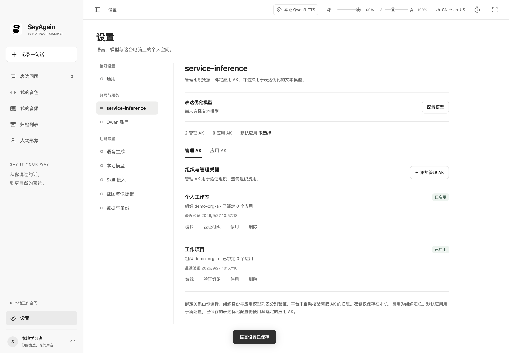
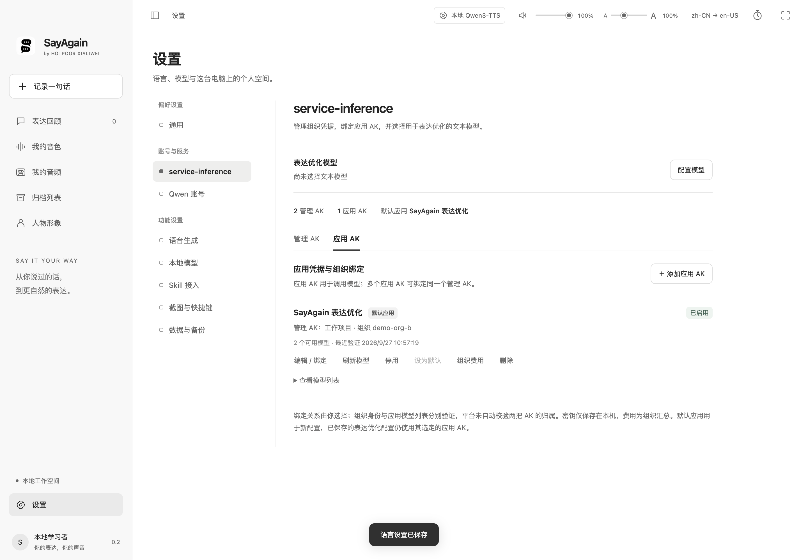
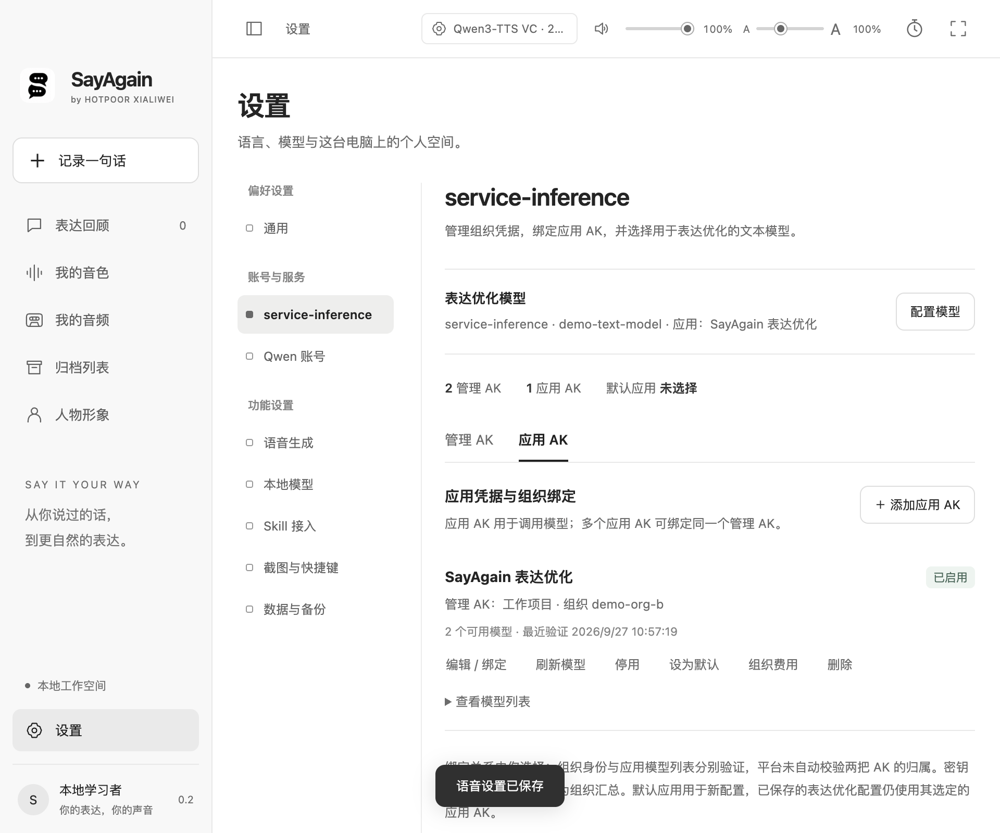

# Electron 设置与 service-inference AK

2026-09-27：设置页采用左侧分类、右侧内容的布局，将账号凭据、语音模型和本地数据分开。分类包括通用、service-inference、Qwen 账号、语音生成、本地模型、Skill 接入、截图与快捷键、数据与备份。切换分类保留未保存字段；键盘上下方向键可切换分类，左右键切换 AK 类型。

## service-inference

参考 hotpoor_director 的管理／应用两类 AK 流程，沿用原来的本地存储结构（`managers`、`usages`、`managerId`），界面统一称为“应用 AK”。已有配置无需手动迁移。

1. 设置 → service-inference → 管理 AK：添加名称与管理密钥，调用固定服务的 `/manage/whoami` 验证组织。
2. 应用 AK：添加名称、应用密钥并选择已启用的管理 AK；调用 `/v1/models` 读取模型列表。多个应用可绑定同一管理凭据，也可编辑改绑。
3. 配置模型：选择应用 AK、文本模型和接口类型，保存后用于表达优化。管理 AK 不参与模型调用。

支持多组凭据、单独启停、验证组织、刷新模型、查看模型列表、设默认应用、显示／隐藏及复制密钥。普通状态响应不包含密钥；只有用户主动显示时返回明文，复制经 Electron 主进程处理。删除仍被引用的管理 AK 会被阻止，已绑定凭据不能直接换成另一个组织。刷新停用的应用仅更新模型列表，不自动启用。

首次保存应用时，在尚无默认应用的情况下设为默认；之后添加、重命名或改绑其他应用不会抢占默认。文本服务配置保存了具体应用 ID，不随默认选择静默改用其他凭据。设置摘要显示表达优化实际选定的应用。

**绑定由用户明确选择。** 组织身份和应用模型列表分别验证，并不声称服务端已自动证明两个 AK 属于同一组织。费用入口使用其绑定管理 AK 查询最近 30 天组织汇总，不是应用独立账单。

## Qwen 账号与语音生成

- Qwen 账号只管理名称、密钥和默认调用账号，单独保存。
- 语音生成保存本地／云端模式、默认模型与云端启用状态，不改账号列表。
- 删除所有 Qwen 账号会关闭云端合成，并同步界面状态。
- 语言、账号、语音偏好保存后不重建整页，避免丢掉其他分类里的草稿。可能重建页面的 Skill 开关、顶部语音设置和备份恢复入口会先保护未保存字段。

## 验证边界

`npm test` 覆盖凭据分流、固定服务地址、改绑、删除保护、停用拦截、显式读取密钥、刷新和默认项保持。真实 Electron 窗口测试使用隔离数据目录与模拟服务响应，无真实付费请求，无复制 Director 的真实 AK。

- `node scripts/smoke-settings.cjs`：多管理／应用 AK、改绑、显示／复制、刷新、组织费用、删除保护、停用阻断模型调用、独立 Qwen 保存、分类草稿、宽窄窗口及重载持久化。
- `node scripts/smoke-inference-keys.cjs`：保留旧命令入口，转至上述测试。
- `node scripts/smoke-desktop.cjs`：录音、音频播放、语言、Qwen、多模型、归档、窗口及重启持久化回归。
- `node scripts/smoke-text-models.cjs` 与 `node scripts/smoke-workflow-completion.cjs`：模型列表、文本调用、草稿保护和备份恢复回归。

修复过程：UI 测试先发现 renderer 的 Clipboard API 在当前 Electron 权限下不可用，改为主进程复制后通过。旧长页的测试滚动断言也改为进入本地模型分类后验证。没有把 mock 响应当作真实账号验证，也没有声称逐像素复刻 Codex。

以下为隔离环境截图，名称与组织均为演示数据，不含真实凭据：

