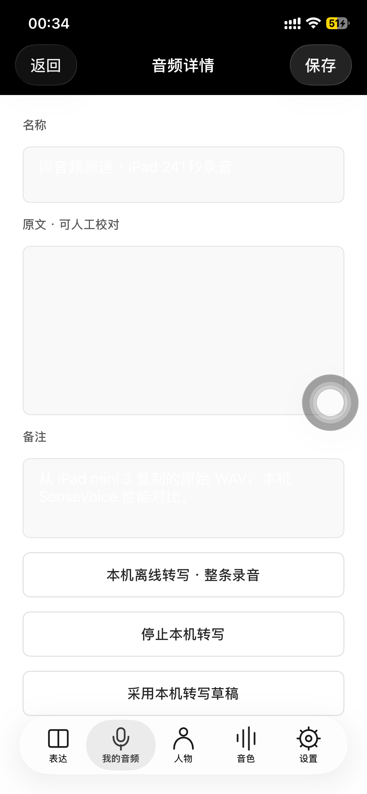
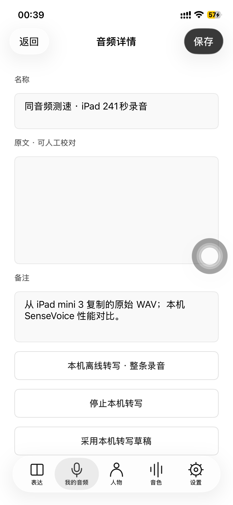

# iPhone 12 Pro：同一条录音的本机 ASR 测速

2026-09-27，实际连接用户 iPhone 12 Pro / iOS 26.6.1，使用 Xcode 26.6 / iOS 26.5 SDK 开发签名安装现代版。原录音从 iPad mini 3 的 SayAgain Documents 读取，经旧 Mac 与本机传至 iPhone；没有发送到云端模型。

桌面端同音频实测见 [Electron / iPhone / 老 iPad 对比](electron-asr-comparison.md)：M1 Max 上相同 29 段三轮中位数 4.4445 秒，默认整条转写 14.3356 秒。

## 输入与算法一致

- WAV：241.4175 秒，24 kHz，单声道，11,592,136 字节。iPad 导出、本机文件、iPhone 回读文件的 SHA-256 完全一致：`aa57d537103e22d71bb0af431f3cc4f8ba5b17449e4ed01f98e463a369a5167f`。
- 同一 SenseVoice INT8 权重，指纹见 [model-manifest.json](../native/model-manifest.json)。验证现代构建包中的模型 SHA-256 与 iPad 模型一致。
- sherpa-onnx 1.10.30 / ONNX Runtime 1.17.1，CPU 单线程；没有改用云端、GPU 或 Neural Engine。
- 同一分段算法，共 29 段；每轮重新创建识别器并实际推理，不复用转写缓存。

## 实测结果

| 设备与构建 | 模型加载 | 推理累计 | App 内总耗时 | 采样进程内存峰值 |
|---|---:|---:|---:|---:|
| iPad mini 3 / iOS 12.5.8，Debug | 25.03 s | 640.31 s | 811.08 s | 311.6 MiB |
| iPhone 12 Pro，Release `-O` 首轮 | 1.40 s | 67.09 s | 69.22 s | 422.55 MiB |
| iPhone 12 Pro，Release `-O` 复测 | 1.44 s | 66.93 s | 69.15 s | 418.02 MiB |
| iPhone 12 Pro，Debug `-Onone` | 1.25 s | 67.09 s | 73.88 s | 414.50 MiB |

iPhone Release 把约四分钟音频在约 1 分 9 秒内处理完，约为实时的 3.49 倍；相对本次 iPad 记录，总耗时比约 11.7 倍。比较两个 Debug 构建则约 11.0 倍，原生模型推理约 9.5 倍。它们是这条录音的实测比例，不是所有输入、所有状态下的固定加速比。

Release 复测与真正的 Debug 对照开始/结束均记录到 **低电量模式开启**、系统热状态 **serious**。未改动用户电源设置，没有测量实际温度数值或关闭低电量模式后的峰值速度。首轮没有状态字段，不能把后续状态倒推成首轮的已知条件。

内存为整个 App 进程的物理 footprint，包含 UI、系统框架与模型；100ms 采样并非内核精确最高水位，不能将跨系统内存差异直接等同于模型净内存差异。测试有 XCTest 自动化开销，未控制温度、电量、系统缓存和后台负载；iPad 与 iPhone 的 OS/编译器版本也不同，不是严格隔离硬件变量的实验。

## 保留一次对照配置错误

首次传入 `-configuration Debug SWIFT_OPTIMIZATION_LEVEL=-Onone`，但 `-xcconfig AppStore.xcconfig` 仍让实际 Swift 编译器使用 `-O`。该轮完成耗时 68.95 秒，仅可作为优化构建的一次额外样本，不能作为未优化对照。

随后新增 [Benchmark-Debug.xcconfig](../app-store/Benchmark-Debug.xcconfig)，在继承现代配置后明确覆盖为 `-Onone`；同时检查展开的 Build Settings 和实际 `swiftc` 参数，重新得到 73.88 秒的有效对照。该过程未改模型或推理线程数。

## 功能与视觉验证

四次完整转写测试均通过：处理至 241.4175 秒，获得非空转写；原文保持不变，终止重开 App 后草稿内容一致。适配测试在 iPad 侧栏与 iPhone 底部标签间选择“我的音频”。没有将此测试当作逐字准确率或所有现代 UI/TTS 功能验收。

首次 iPhone 真机截图发现深色模式让固定浅色表单显示白字；通过 App 的 `UIUserInterfaceStyle=Light` 修复，保留统一浅色视觉，不改用户系统主题。修复后真机截图确认可读；包含状态字段与界面修复的源码也通过旧 Mac / Xcode 13.2.1 / iOS 12 目标编译。

| 修复前 | 修复后 |
|---|---|
|  |  |

最终手机保留现代 Release 开发签名版本，原始录音位于“我的音频 → 同音频测速 · iPad 241秒录音”。常用草稿恢复为已实测的 Release 复测结果；Documents 另保留 `iphone12pro-release-benchmark.json` 与 `iphone12pro-debug-benchmark.json` 供比较。用户原录音/原文字未被覆盖。

## 证据与复现

- [不含用户转写全文的测量 JSON](benchmarks/2026-09-27-iphone12pro.json)。音频和原始转写不提交 Git。
- 四个原始结果包保留在本机忽略目录 `ios/build/benchmarks/sayagain-iphone-{release,debug,release-final,onone}-asr.xcresult`。
- App 内草稿报告包含音频时长、片段、加载/推理/总时间、采样内存和新增的首尾低电量/系统热状态。新增状态字段为可选字段，兼容已有草稿。

准备录音后，仓库根目录运行（替换设备 UDID；`/tmp/your-new-result.xcresult` 必须尚不存在）：

```sh
xcodebuild -project ios/SayAgain.xcodeproj -scheme SayAgain \
  -configuration Release -xcconfig ios/app-store/AppStore.xcconfig \
  -destination 'id=YOUR_DEVICE_UDID' -derivedDataPath ios/build/iphone-benchmark \
  -allowProvisioningUpdates -resultBundlePath /tmp/your-new-result.xcresult \
  -only-testing:SayAgainUITests/SmokeTests/testLocalASRFullRecording test
```

未优化对照改用 `-configuration Debug -xcconfig ios/app-store/Benchmark-Debug.xcconfig`。该用例会处理当前录音列表第一条，应先确认所选录音；会刷新其独立 ASR 草稿，不采用/保存到原文字。
